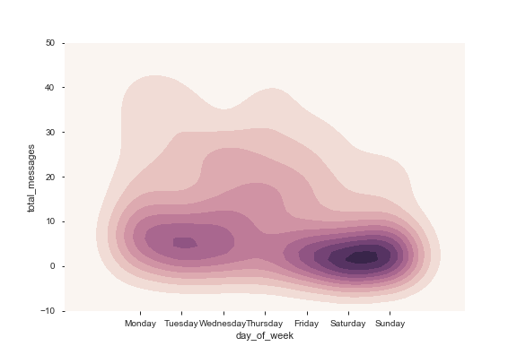
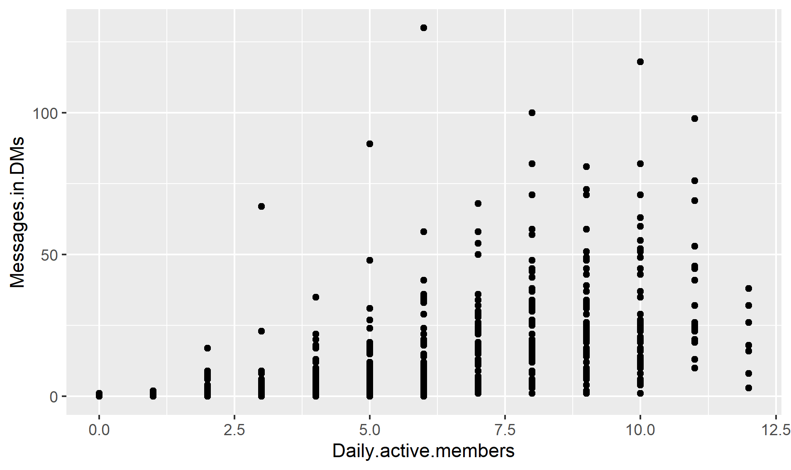

# example_analytics report
 
## 2020-01-20

- Initialised project directory, including raw results in raw_data

### example_plots

**Input**: raw.csv
**Output**: plot png
**Prerequisites**:  None
**Language/interpreter**  python

- Example plotting options for Collaborative exercise

## 2020-01-20 Report Draft

Dezerae investigated the messages posted per day of the week. We can see that Slack is being used, even on the weekend, to pose up to 40 messages per day.

There is on average 18 messages posted per day during the week, and 8 messages posted per day on weekends.

Chez investigated the Number of direct messages per number of daily active members. As we can see, 6 members is enough to reach the maximum number of messages.

